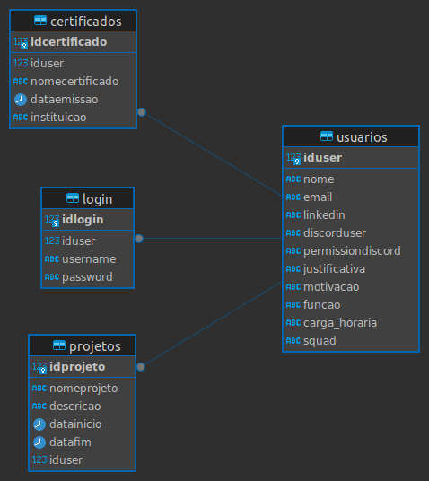

# Banco de Dados de Instituição Educacional

## Database: Hackathon Bichinhos da TI

Este projeto envolve a criação e gerenciamento de um banco de dados no PostgreSQL, voltado para a administração de um hackathon. A estrutura do banco de dados inclui quatro tabelas principais e uma tabela específica para logs, gerados por uma trigger.

Segue o esquema do banco de dados.

### Tabelas
1. **Usuarios**
   - Armazena informações dos usuários.
   
2. **Login**
   - Armazena informações de login, com senha criptografada.
   
3. **Certificados**
   - Armazena informações sobre os certificados dos usuários.
   
4. **Projetos**
   - Armazena informações sobre os projetos dos usuários.
   
5. **Logs**
   - Armazena logs de operações (inserção, atualização, deleção) realizadas nas tabelas acima.

### Arquivos
- **tables.sql**
  - Contém as definições de tabelas e tipos ENUM.
  
- **triggers.sql**
  - Contém as definições de funções e triggers para logs e criptografia de senha.

## Administração
O banco de dados será administrado e abordado inteiramente no PostgreSQL, utilizando as ferramentas disponíveis no pgAdmin4.

## Autor
Projeto desenvolvido para o Hackathon: Bichinhos da TI por Willan Ribeiro dos Santos(https://github.com/ribeirowillian) e Juan Lucas Lopes Vieira (https://github.com/ju4nv1e1r4).
