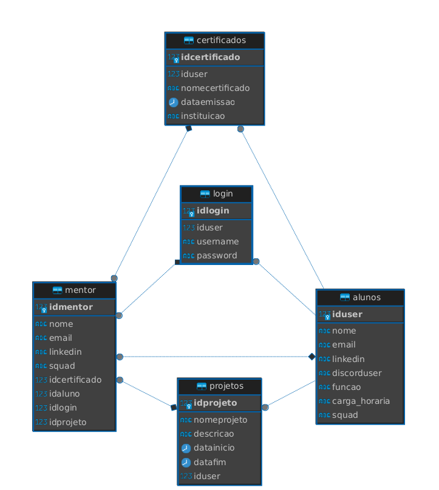

# Banco de Dados de Instituição Educacional

Este repositório contém as definições de tabelas para um banco de dados de uma instituição educacional. A estrutura abrange informações sobre cursos, professores, turmas, alunos, disciplinas, horários, notas, matrículas e logins.

